# Dokumentasi Teknis Backend RentOn — DDL, UML, Diagram Arsitektur & Flowchart

**Sumber:** `RentonBachkEnd-main` (CodeIgniter 3.1.10, MySQL, modul `admin` / `agent` / `api`)
**Cakupan:** 69 tabel database, 3 modul aplikasi (Admin Backoffice, Agent Portal, REST API Mobile), dikelompokkan per fitur bisnis.
**Cara baca:** Semua diagram ditulis dengan sintaks [Mermaid](https://mermaid.js.org/) — akan otomatis dirender sebagai gambar oleh GitHub, GitLab, Notion, atau ekstensi Markdown Preview Mermaid di VSCode. Jika preview di editor Anda tidak menampilkan gambar, install ekstensi "Markdown Preview Mermaid Support".

---

## Daftar Isi

1. [Diagram Arsitektur Sistem (Graph Diagram)](#1-diagram-arsitektur-sistem-graph-diagram)
2. [Pengelompokan Fitur & Modul](#2-pengelompokan-fitur--modul)
3. [DDL — Skema Database per Kelompok Fitur](#3-ddl--skema-database-per-kelompok-fitur)
4. [Indeks Database & Relasi Antar Tabel](#4-indeks-database--relasi-antar-tabel)
5. [UML — Entity Relationship Diagram per Kelompok](#5-uml--entity-relationship-diagram-per-kelompok)
6. [Flowchart per Fitur](#6-flowchart-per-fitur)
7. [Lampiran — Peta Endpoint per Modul](#7-lampiran--peta-endpoint-per-modul)

---

## 1. Diagram Arsitektur Sistem (Graph Diagram)

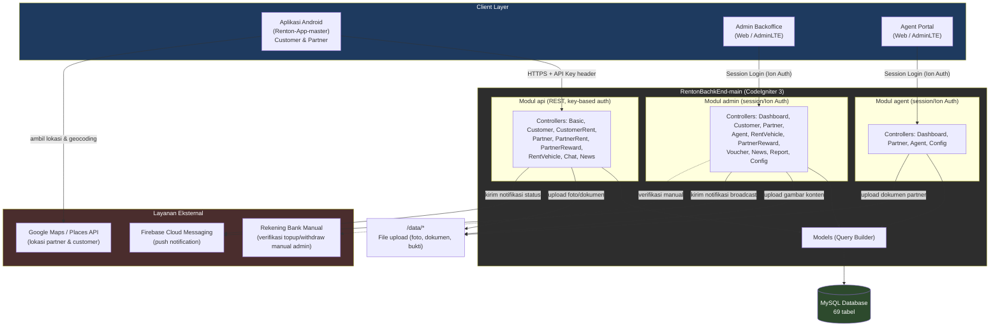

**Poin arsitektur:**
- Satu database MySQL dipakai bersama oleh ketiga entry point (mobile REST API, admin panel, agent panel) — tidak ada pemisahan service, semua berjalan sebagai satu aplikasi CodeIgniter monolitik dengan modul HMVC (`admin`/`agent`/`api`).
- Autentikasi berbeda per modul: `api` pakai API key per akun (tabel `keys`), sedangkan `admin`/`agent` pakai session login Ion Auth.
- Notifikasi status transaksi (booking, withdraw, dsb.) dikirim ke customer & partner via Firebase Cloud Messaging.
- Tidak ada payment gateway otomatis — topup & withdraw diverifikasi **manual** oleh admin berdasarkan bukti transfer yang diunggah (lihat flowchart §6.6 & §6.7).

---

## 2. Pengelompokan Fitur & Modul

| Kelompok Fitur | Tabel Utama | Modul Terkait | Aktor |
|---|---|---|---|
| **A. Master Data & Wilayah** | provinces, regencies, districts, villages, vehicle_type, vehicle_model, brand, color, fuel, transmition_type, driven_type, functional_type, feature, feature_status, status, active_status, ownerships, bank | admin/Config, admin/RentVehicle | Admin |
| **B. Akun & Autentikasi** | accounts, groups, accounts_groups, keys, login_attempts, logs, notification | Auth.php, api/Basic, semua modul | Semua role |
| **C. Customer** | customers, customers_file, customers_location | api/Customer, admin/Customer | Customer, Admin |
| **D. Partner (Mitra)** | partners, partners_file, partners_config, partners_features | api/Partner, admin/Partner, agent/Partner | Partner, Admin, Agent |
| **E. Agent** | agents, agents_file, agents_bank, agents_balance, agents_commision, agent_withdraw, agent_withdraw_status, history_agent_transaction | admin/Agent, agent/* | Agent, Admin |
| **F. Kendaraan & Transaksi Sewa** | rent_vehicles_item, rent_vehicles_item_images, transaction_rent_vehicle, transaction_rent_vehicle_status, timeline_transaction_rent_vehicle, transaction_repair_vehicle, promote_rent_vehicle, promote_rent_vehicle_status, review_vehicle, review_customer | api/RentVehicle, api/PartnerRent, api/CustomerRent, admin/RentVehicle | Customer, Partner, Admin |
| **G. Keuangan / Wallet** | accounts_balance, accounts_bank, company_bank, customer_topup, customer_topup_status, customer_withdraw, customer_withdraw_status, transaction_point | api/Customer (topup/withdraw), admin/Customer, admin/Config | Customer, Admin |
| **H. Loyalty & Marketing** | vouchers, voucher_type, partner_rewards, reward_type, reward_scope, history_partner_reward, news, news_preview | api/PartnerReward, api/News, admin/Voucher, admin/PartnerReward, admin/News | Customer, Partner, Admin |
| **I. Engagement** | chatroom, chat_message | api/Chat | Customer, Partner |
| **J. Sistem** | config | admin/Config | Admin |

---

## 3. DDL — Skema Database per Kelompok Fitur

> DDL diringkas dari `database/db_rentone_06_Dec_2021.sql`. Kolom index tambahan (`ADD KEY`) dan `AUTO_INCREMENT` dihilangkan dari cuplikan agar ringkas — struktur constraint (`PRIMARY KEY`, `FOREIGN KEY`) tetap dipertahankan penuh sesuai file asli.

### 3.A Master Data & Wilayah

```sql
CREATE TABLE `provinces` (
  `id` char(2) NOT NULL,
  `name` varchar(255) NOT NULL,
  PRIMARY KEY (`id`)
);

CREATE TABLE `regencies` (
  `id` char(4) NOT NULL,
  `province_id` char(2) NOT NULL,
  `name` varchar(255) NOT NULL,
  PRIMARY KEY (`id`),
  CONSTRAINT `regencies_province_id_foreign` FOREIGN KEY (`province_id`) REFERENCES `provinces` (`id`)
);

CREATE TABLE `districts` (
  `id` char(7) NOT NULL,
  `regency_id` char(4) NOT NULL,
  `name` varchar(255) NOT NULL,
  PRIMARY KEY (`id`),
  CONSTRAINT `districts_regency_id_foreign` FOREIGN KEY (`regency_id`) REFERENCES `regencies` (`id`)
);

CREATE TABLE `villages` (
  `id` char(10) NOT NULL,
  `district_id` char(7) NOT NULL,
  `name` varchar(255) NOT NULL,
  PRIMARY KEY (`id`),
  CONSTRAINT `villages_district_id_foreign` FOREIGN KEY (`district_id`) REFERENCES `districts` (`id`)
);

CREATE TABLE `functional_type` (          -- kategori fungsi kendaraan (mis. mobil/motor)
  `id` int(11) NOT NULL PRIMARY KEY,
  `name` varchar(255) DEFAULT NULL,
  `icon` text DEFAULT NULL
);

CREATE TABLE `vehicle_type` (
  `id` int(11) NOT NULL PRIMARY KEY,
  `functional_type` int(11) DEFAULT NULL,
  `name` varchar(255) DEFAULT NULL,
  `icon` text DEFAULT NULL,
  CONSTRAINT `vehicle_type_functional_type` FOREIGN KEY (`functional_type`) REFERENCES `functional_type` (`id`)
);

CREATE TABLE `brand` (
  `id` int(11) NOT NULL PRIMARY KEY,
  `functional_type` int(11) DEFAULT NULL,
  `name` varchar(255) DEFAULT NULL,
  `icon` text DEFAULT NULL,
  CONSTRAINT `brand_functional_type` FOREIGN KEY (`functional_type`) REFERENCES `functional_type` (`id`)
);

CREATE TABLE `vehicle_model` (
  `id` int(11) NOT NULL PRIMARY KEY,
  `brand_id` int(11) DEFAULT NULL,
  `name` varchar(255) DEFAULT NULL,
  CONSTRAINT `vehicle_model_brand` FOREIGN KEY (`brand_id`) REFERENCES `brand` (`id`)
);

CREATE TABLE `color` (
  `id` int(11) NOT NULL PRIMARY KEY,
  `name` varchar(255) DEFAULT NULL,
  `value` varchar(255) DEFAULT NULL
);

CREATE TABLE `fuel` (
  `id` int(11) NOT NULL PRIMARY KEY,
  `name` varchar(255) DEFAULT NULL,
  `icon` text DEFAULT NULL
);

CREATE TABLE `transmition_type` (
  `id` int(11) NOT NULL PRIMARY KEY,
  `functional_type` int(11) DEFAULT NULL,
  `name` varchar(255) DEFAULT NULL,
  `icon` text DEFAULT NULL,
  CONSTRAINT `transmition_type_functional_type` FOREIGN KEY (`functional_type`) REFERENCES `functional_type` (`id`)
);

CREATE TABLE `driven_type` (              -- self-drive / with-driver
  `id` int(11) NOT NULL PRIMARY KEY,
  `functional_type` int(11) DEFAULT NULL,
  `name` varchar(255) DEFAULT NULL,
  `icon` text DEFAULT NULL,
  CONSTRAINT `driven_type_functional_type` FOREIGN KEY (`functional_type`) REFERENCES `functional_type` (`id`)
);

CREATE TABLE `feature` (                  -- fitur layanan: rental / repair, dsb.
  `id` int(11) NOT NULL PRIMARY KEY,
  `name` varchar(255) DEFAULT NULL,
  `icon` text DEFAULT NULL
);

CREATE TABLE `feature_status` (
  `id` int(2) UNSIGNED NOT NULL PRIMARY KEY,
  `name` varchar(255) DEFAULT NULL
);

CREATE TABLE `status` (                   -- status generik (dipakai news, vouchers)
  `id` int(11) NOT NULL PRIMARY KEY,
  `name` varchar(255) DEFAULT NULL
);

CREATE TABLE `active_status` (
  `id` int(1) UNSIGNED NOT NULL PRIMARY KEY,
  `name` varchar(255) DEFAULT NULL
);

CREATE TABLE `ownerships` (               -- status kepemilikan kendaraan partner
  `id` int(11) NOT NULL PRIMARY KEY,
  `name` varchar(255) DEFAULT NULL
);

CREATE TABLE `bank` (
  `id` int(11) NOT NULL PRIMARY KEY,
  `name` varchar(255) DEFAULT NULL,
  `code` varchar(255) DEFAULT NULL,
  `icon` text DEFAULT NULL
);
```

### 3.B Akun & Autentikasi

```sql
CREATE TABLE `accounts` (                 -- tabel identitas terpusat, dipakai Ion Auth
  `id` int(11) UNSIGNED NOT NULL PRIMARY KEY,
  `ip_address` varchar(45) NOT NULL,
  `username` varchar(100) DEFAULT NULL,
  `password` varchar(255) NOT NULL,       -- password_hash() bcrypt/argon2
  `email` varchar(254) NOT NULL,
  `activation_selector` varchar(255) DEFAULT NULL,
  `activation_code` varchar(255) DEFAULT NULL,
  `forgotten_password_selector` varchar(255) DEFAULT NULL,
  `forgotten_password_code` varchar(255) DEFAULT NULL,
  `forgotten_password_time` int(11) UNSIGNED DEFAULT NULL,
  `remember_selector` varchar(255) DEFAULT NULL,
  `remember_code` varchar(255) DEFAULT NULL,
  `created_on` int(11) UNSIGNED NOT NULL,
  `last_login` int(11) UNSIGNED DEFAULT NULL,
  `active` int(1) UNSIGNED DEFAULT NULL,
  `first_name` varchar(50) DEFAULT NULL,
  `last_name` varchar(50) DEFAULT NULL,
  `company` varchar(100) DEFAULT NULL,
  `phone` varchar(20) DEFAULT NULL,
  `token` varchar(255) DEFAULT NULL,      -- FCM device token
  CONSTRAINT `accounts_active_status` FOREIGN KEY (`active`) REFERENCES `active_status` (`id`)
);

CREATE TABLE `groups` (                   -- role: admin, supervisor, staff, partner, user, reader, agent
  `id` mediumint(8) UNSIGNED NOT NULL PRIMARY KEY,
  `name` varchar(20) NOT NULL,
  `description` varchar(100) NOT NULL
);

CREATE TABLE `accounts_groups` (
  `id` int(11) UNSIGNED NOT NULL PRIMARY KEY,
  `account_id` int(11) UNSIGNED NOT NULL,
  `group_id` mediumint(8) UNSIGNED NOT NULL,
  CONSTRAINT `fk_users_groups_users1` FOREIGN KEY (`account_id`) REFERENCES `accounts` (`id`) ON DELETE CASCADE,
  CONSTRAINT `fk_users_groups_groups1` FOREIGN KEY (`group_id`) REFERENCES `groups` (`id`) ON DELETE CASCADE
);

CREATE TABLE `keys` (                     -- API key REST per akun (autentikasi mobile)
  `id` int(11) NOT NULL PRIMARY KEY,
  `account_id` int(11) UNSIGNED NOT NULL,
  `key` varchar(40) NOT NULL,
  `level` int(2) NOT NULL,
  `ignore_limits` tinyint(1) NOT NULL DEFAULT 0,
  `is_private_key` tinyint(1) NOT NULL DEFAULT 0,
  `ip_addresses` text DEFAULT NULL,
  `date_created` int(11) NOT NULL,
  CONSTRAINT `keys_accounts` FOREIGN KEY (`account_id`) REFERENCES `accounts` (`id`) ON DELETE CASCADE
);

CREATE TABLE `login_attempts` (
  `id` int(11) UNSIGNED NOT NULL PRIMARY KEY,
  `ip_address` varchar(45) NOT NULL,
  `login` varchar(100) NOT NULL,
  `time` int(11) UNSIGNED DEFAULT NULL
);

CREATE TABLE `logs` (                     -- log request REST API
  `id` int(11) NOT NULL PRIMARY KEY,
  `uri` varchar(255) NOT NULL,
  `method` varchar(6) NOT NULL,
  `params` text DEFAULT NULL,
  `api_key` varchar(40) NOT NULL,
  `ip_address` varchar(45) NOT NULL,
  `time` int(11) NOT NULL,
  `rtime` float DEFAULT NULL,
  `authorized` varchar(1) NOT NULL,
  `response_code` smallint(3) DEFAULT 0
);

CREATE TABLE `notification` (
  `id` int(11) NOT NULL PRIMARY KEY,
  `account_id` int(10) UNSIGNED DEFAULT NULL,
  `data_type` int(11) DEFAULT NULL,
  `data` text DEFAULT NULL,
  `link` varchar(255) DEFAULT NULL,
  `message` varchar(255) DEFAULT NULL,
  `date_added` timestamp NULL DEFAULT current_timestamp()
);
```

### 3.C Customer

```sql
CREATE TABLE `customers` (
  `id` int(11) NOT NULL PRIMARY KEY,
  `account_id` int(10) UNSIGNED DEFAULT NULL,
  `img_profile` varchar(255) DEFAULT NULL,
  `identity_number` varchar(255) DEFAULT NULL,   -- NIK / no. KTP
  `referal_id` int(11) DEFAULT NULL,
  CONSTRAINT `customers_accounts` FOREIGN KEY (`account_id`) REFERENCES `accounts` (`id`) ON DELETE CASCADE
);

CREATE TABLE `customers_file` (           -- dokumen identitas (foto KTP)
  `id` int(11) NOT NULL PRIMARY KEY,
  `account_id` int(10) UNSIGNED DEFAULT NULL,
  `img_identity` varchar(255) DEFAULT NULL,
  CONSTRAINT `customers_file_accounts` FOREIGN KEY (`account_id`) REFERENCES `accounts` (`id`) ON DELETE CASCADE
);

CREATE TABLE `customers_location` (       -- lokasi realtime untuk pencarian "terdekat"
  `id` int(11) NOT NULL PRIMARY KEY,
  `account_id` int(10) UNSIGNED DEFAULT NULL,
  `latitude` decimal(20,14) DEFAULT NULL,
  `longitude` decimal(20,14) DEFAULT NULL,
  `last_update` timestamp NULL DEFAULT current_timestamp() ON UPDATE current_timestamp(),
  CONSTRAINT `customers_location_accounts` FOREIGN KEY (`account_id`) REFERENCES `accounts` (`id`) ON DELETE CASCADE
);
```

### 3.D Partner (Mitra)

```sql
CREATE TABLE `partners` (
  `id` int(11) NOT NULL PRIMARY KEY,
  `account_id` int(11) UNSIGNED NOT NULL,
  `ownership_id` int(11) DEFAULT NULL,
  `company_name` varchar(100) DEFAULT NULL,
  `tax_number` varchar(50) DEFAULT NULL,
  `img_profile` varchar(255) DEFAULT NULL,
  `regencies_id` int(11) DEFAULT NULL,
  `address` varchar(255) DEFAULT NULL,
  `latitude` decimal(20,14) DEFAULT NULL,
  `longitude` decimal(20,14) DEFAULT NULL,
  `description` text DEFAULT NULL,
  `referal_id` int(11) DEFAULT NULL,
  `agent_id` int(11) DEFAULT NULL,        -- agen yang merekrut partner ini (relasi non-FK)
  `status` int(1) UNSIGNED DEFAULT 0,
  `date_added` timestamp NULL DEFAULT current_timestamp(),
  `date_modified` timestamp NULL DEFAULT current_timestamp() ON UPDATE current_timestamp(),
  CONSTRAINT `partners_account_id_accounts1` FOREIGN KEY (`account_id`) REFERENCES `accounts` (`id`) ON DELETE CASCADE,
  CONSTRAINT `partners_active_status` FOREIGN KEY (`status`) REFERENCES `active_status` (`id`),
  CONSTRAINT `partners_ownerships` FOREIGN KEY (`ownership_id`) REFERENCES `ownerships` (`id`)
);

CREATE TABLE `partners_file` (            -- dokumen legalitas usaha
  `id` int(11) NOT NULL PRIMARY KEY,
  `account_id` int(11) UNSIGNED DEFAULT NULL,
  `img_identity` varchar(255) DEFAULT NULL,
  `img_driver_licence` varchar(255) DEFAULT NULL,
  `img_bussiness_licence` varchar(255) DEFAULT NULL,
  `img_bussiness_registration` varchar(255) DEFAULT NULL,
  CONSTRAINT `partners_file_accounts` FOREIGN KEY (`account_id`) REFERENCES `accounts` (`id`) ON DELETE CASCADE,
  CONSTRAINT `partners_file_partners` FOREIGN KEY (`account_id`) REFERENCES `partners` (`account_id`) ON DELETE CASCADE
);

CREATE TABLE `partners_config` (          -- aturan operasional per partner
  `id` int(11) NOT NULL PRIMARY KEY,
  `account_id` int(10) UNSIGNED DEFAULT NULL,
  `force_with_driver` int(1) DEFAULT 0,
  `max_day_cod` int(3) DEFAULT 1,
  `force_disable_delivery` int(1) DEFAULT 0,
  `delivery_fee` decimal(14,2) DEFAULT 0.00,
  `force_disable_pickoff` int(1) DEFAULT 0,
  `pickoff_fee` decimal(14,2) DEFAULT 0.00,
  `overtime_fee` decimal(14,2) DEFAULT 0.00,
  `date_modified` timestamp NULL DEFAULT current_timestamp() ON UPDATE current_timestamp(),
  CONSTRAINT `partners_config_accounts` FOREIGN KEY (`account_id`) REFERENCES `accounts` (`id`) ON DELETE CASCADE,
  CONSTRAINT `partners_config_partners` FOREIGN KEY (`account_id`) REFERENCES `partners` (`account_id`) ON DELETE CASCADE
);

CREATE TABLE `partners_features` (        -- fitur tambahan yang diajukan partner (mis. layanan repair)
  `id` int(11) NOT NULL PRIMARY KEY,
  `account_id` int(10) UNSIGNED DEFAULT NULL,
  `feature_id` int(11) DEFAULT NULL,
  `description` varchar(255) DEFAULT NULL,
  `status` int(2) UNSIGNED NOT NULL DEFAULT 0,
  `date_added` timestamp NULL DEFAULT current_timestamp(),
  `date_modified` timestamp NULL DEFAULT current_timestamp() ON UPDATE current_timestamp(),
  CONSTRAINT `partners_features_accounts` FOREIGN KEY (`account_id`) REFERENCES `accounts` (`id`) ON DELETE CASCADE,
  CONSTRAINT `partners_features_partners` FOREIGN KEY (`account_id`) REFERENCES `partners` (`account_id`) ON DELETE CASCADE,
  CONSTRAINT `partners_features_feature` FOREIGN KEY (`feature_id`) REFERENCES `feature` (`id`),
  CONSTRAINT `partners_features_partners_status` FOREIGN KEY (`status`) REFERENCES `feature_status` (`id`)
);
```

### 3.E Agent

```sql
CREATE TABLE `agents` (
  `id` int(11) NOT NULL PRIMARY KEY,
  `account_id` int(10) UNSIGNED DEFAULT NULL,
  `img_profile` varchar(255) DEFAULT NULL,
  `identity_number` varchar(255) DEFAULT NULL,
  `regencies_id` int(11) DEFAULT NULL,
  `address` varchar(255) DEFAULT NULL,
  `status` int(2) DEFAULT 0,
  CONSTRAINT `agents_accounts` FOREIGN KEY (`account_id`) REFERENCES `accounts` (`id`) ON DELETE CASCADE
);

CREATE TABLE `agents_file` (
  `id` int(11) NOT NULL PRIMARY KEY,
  `account_id` int(10) UNSIGNED DEFAULT NULL,
  `img_identity` varchar(255) DEFAULT NULL,
  CONSTRAINT `agents_file_accounts` FOREIGN KEY (`account_id`) REFERENCES `accounts` (`id`) ON DELETE CASCADE
);

CREATE TABLE `agents_bank` (
  `id` int(11) NOT NULL PRIMARY KEY,
  `account_id` int(10) UNSIGNED DEFAULT NULL,
  `bank_id` int(11) DEFAULT NULL,
  `bank_number` varchar(255) DEFAULT NULL,
  `name` varchar(255) DEFAULT NULL,
  `date_added` timestamp NULL DEFAULT current_timestamp(),
  `date_modified` timestamp NULL DEFAULT current_timestamp() ON UPDATE current_timestamp(),
  CONSTRAINT `agents_bank_accounts` FOREIGN KEY (`account_id`) REFERENCES `accounts` (`id`) ON DELETE CASCADE,
  CONSTRAINT `agents_bank_ibfk_1` FOREIGN KEY (`bank_id`) REFERENCES `bank` (`id`)
);

CREATE TABLE `agents_balance` (
  `id` int(11) NOT NULL PRIMARY KEY,
  `account_id` int(10) UNSIGNED DEFAULT NULL,
  `balance` decimal(12,2) DEFAULT 0.00,
  `point` int(11) DEFAULT 0,
  CONSTRAINT `agents_balance_accounts` FOREIGN KEY (`account_id`) REFERENCES `accounts` (`id`) ON DELETE CASCADE
);

CREATE TABLE `agents_commision` (         -- tier target & persentase komisi
  `id` int(11) NOT NULL PRIMARY KEY,
  `title` varchar(255) DEFAULT NULL,
  `description` varchar(255) DEFAULT NULL,
  `min_target` int(11) DEFAULT NULL,
  `max_target` int(11) DEFAULT NULL,
  `percentage` decimal(10,2) DEFAULT NULL,
  `date_added` timestamp NULL DEFAULT current_timestamp(),
  `date_modified` timestamp NULL DEFAULT current_timestamp() ON UPDATE current_timestamp()
);

CREATE TABLE `agent_withdraw` (
  `id` int(11) NOT NULL PRIMARY KEY,
  `account_id` int(11) UNSIGNED DEFAULT NULL,
  `account_bank_id` int(11) DEFAULT NULL,
  `value` decimal(12,2) DEFAULT NULL,
  `description` varchar(255) DEFAULT NULL,
  `status` int(2) DEFAULT NULL,
  `processed` int(1) DEFAULT 0,
  `date_added` timestamp NULL DEFAULT current_timestamp(),
  CONSTRAINT `agent_withdraw_ibfk_1` FOREIGN KEY (`account_id`) REFERENCES `accounts` (`id`) ON DELETE CASCADE,
  CONSTRAINT `agent_withdraw_ibfk_2` FOREIGN KEY (`status`) REFERENCES `customer_withdraw_status` (`id`)
);

CREATE TABLE `agent_withdraw_status` (
  `id` int(11) NOT NULL PRIMARY KEY,
  `name` varchar(255) DEFAULT NULL
);

CREATE TABLE `history_agent_transaction` ( -- log komisi masuk per transaksi partner rekrutan
  `id` int(11) NOT NULL PRIMARY KEY,
  `account_id` int(10) UNSIGNED DEFAULT NULL,
  `feature_id` int(11) DEFAULT NULL,
  `transaction_id` int(11) DEFAULT NULL,
  `description` varchar(255) DEFAULT NULL,
  `percentage` decimal(10,2) DEFAULT NULL,
  `value` decimal(14,2) DEFAULT NULL,
  `date_added` timestamp NULL DEFAULT current_timestamp() ON UPDATE current_timestamp(),
  CONSTRAINT `history_agent_transaction_accounts` FOREIGN KEY (`account_id`) REFERENCES `accounts` (`id`) ON DELETE CASCADE
);
```

### 3.F Kendaraan & Transaksi Sewa (Inti Bisnis)

```sql
CREATE TABLE `rent_vehicles_item` (
  `id` int(11) UNSIGNED NOT NULL PRIMARY KEY,
  `account_id` int(11) UNSIGNED DEFAULT NULL,     -- pemilik = partner
  `functional_type` int(5) DEFAULT NULL,
  `vehicle_type` int(5) DEFAULT NULL,
  `title` varchar(255) DEFAULT NULL,
  `brand_id` int(11) DEFAULT NULL,
  `vehicle_model` int(11) DEFAULT NULL,
  `year` int(5) DEFAULT NULL,
  `color_id` int(5) DEFAULT NULL,
  `max_passenger` int(5) DEFAULT NULL,
  `max_baggage` int(5) DEFAULT 0,
  `driven_type` int(5) DEFAULT NULL,
  `transmition_type` int(5) DEFAULT NULL,
  `fuel_type` int(5) DEFAULT NULL,
  `price` decimal(14,2) DEFAULT 0.00,
  `with_driver` int(1) DEFAULT NULL,
  `price_with_driver_basic` decimal(14,2) DEFAULT 0.00,
  `price_with_driver_full` decimal(14,2) DEFAULT 0.00,
  `delivered` int(1) DEFAULT 0,
  `pickoff` int(1) DEFAULT 0,
  `status` int(5) DEFAULT 1,
  `date_added` timestamp NULL DEFAULT current_timestamp(),
  `date_modified` timestamp NULL DEFAULT current_timestamp() ON UPDATE current_timestamp(),
  CONSTRAINT `rent_vehicles_item_accounts` FOREIGN KEY (`account_id`) REFERENCES `accounts` (`id`) ON DELETE CASCADE,
  CONSTRAINT `rent_vehicles_item_partners` FOREIGN KEY (`account_id`) REFERENCES `partners` (`account_id`) ON DELETE CASCADE,
  CONSTRAINT `rent_vehicles_item_brand` FOREIGN KEY (`brand_id`) REFERENCES `brand` (`id`),
  CONSTRAINT `rent_vehicles_item_vehicle_vehicle_model` FOREIGN KEY (`vehicle_model`) REFERENCES `vehicle_model` (`id`),
  CONSTRAINT `rent_vehicles_item_color` FOREIGN KEY (`color_id`) REFERENCES `color` (`id`) ON DELETE SET NULL,
  CONSTRAINT `rent_vehicles_item_driven_type` FOREIGN KEY (`driven_type`) REFERENCES `driven_type` (`id`) ON DELETE SET NULL,
  CONSTRAINT `rent_vehicles_item_transmition_type` FOREIGN KEY (`transmition_type`) REFERENCES `transmition_type` (`id`) ON DELETE SET NULL,
  CONSTRAINT `rent_vehicles_item_fuel` FOREIGN KEY (`fuel_type`) REFERENCES `fuel` (`id`) ON DELETE SET NULL,
  CONSTRAINT `rent_vehicles_item_functional_type` FOREIGN KEY (`functional_type`) REFERENCES `functional_type` (`id`) ON DELETE SET NULL,
  CONSTRAINT `rent_vehicles_item_vehicle_type` FOREIGN KEY (`vehicle_type`) REFERENCES `vehicle_type` (`id`) ON DELETE SET NULL
);

CREATE TABLE `rent_vehicles_item_images` (
  `id` int(11) NOT NULL PRIMARY KEY,
  `item_id` int(11) UNSIGNED DEFAULT NULL,
  `img` varchar(255) DEFAULT NULL,
  `date_added` timestamp NULL DEFAULT current_timestamp(),
  CONSTRAINT `rent_vehicles_item_images_rent_vehicles_item` FOREIGN KEY (`item_id`) REFERENCES `rent_vehicles_item` (`id`) ON DELETE CASCADE
);

CREATE TABLE `transaction_rent_vehicle` (
  `id` int(11) NOT NULL PRIMARY KEY,
  `account_id` int(11) UNSIGNED DEFAULT NULL,      -- customer penyewa
  `feature_id` int(11) DEFAULT 1,
  `item_id` int(11) UNSIGNED DEFAULT NULL,
  `price_package` int(1) DEFAULT NULL,
  `price_package_name` varchar(255) DEFAULT NULL,
  `price` decimal(14,2) DEFAULT 0.00,
  `start_date` datetime DEFAULT NULL,
  `end_date` datetime DEFAULT NULL,
  `delivery` int(1) DEFAULT 0,
  `delivery_date` datetime DEFAULT NULL,
  `delivery_address` varchar(255) DEFAULT NULL,
  `delivery_latitude` decimal(20,14) DEFAULT NULL,
  `delivery_longitude` decimal(20,14) DEFAULT NULL,
  `delivery_fee` decimal(14,2) DEFAULT 0.00,
  `pickoff` int(1) DEFAULT 0,
  `pickoff_date` datetime DEFAULT NULL,
  `pickoff_address` varchar(255) DEFAULT NULL,
  `pickoff_latitude` decimal(20,14) DEFAULT NULL,
  `pickoff_longitude` decimal(20,14) DEFAULT NULL,
  `pickoff_fee` decimal(14,2) DEFAULT 0.00,
  `voucher_id` int(11) DEFAULT NULL,
  `discount` decimal(14,2) DEFAULT 0.00,
  `total_payment` decimal(14,2) DEFAULT 0.00,
  `cash_on_delivery` int(1) DEFAULT 0,
  `overtime` int(1) DEFAULT 0,
  `overtime_hour` int(11) DEFAULT 0,
  `overtime_fee` decimal(14,2) DEFAULT 0.00,
  `total_overtime_fee` decimal(14,2) DEFAULT 0.00,
  `admin_fee` decimal(14,2) DEFAULT 0.00,
  `status` int(1) DEFAULT NULL,
  `description` varchar(255) DEFAULT NULL,
  `date_added` timestamp NULL DEFAULT current_timestamp(),
  `date_modified` timestamp NULL DEFAULT current_timestamp() ON UPDATE current_timestamp(),
  CONSTRAINT `transaction_rent_vehicle_accounts` FOREIGN KEY (`account_id`) REFERENCES `accounts` (`id`) ON DELETE CASCADE,
  CONSTRAINT `transaction_rent_vehicle_rent_vehicle_item` FOREIGN KEY (`item_id`) REFERENCES `rent_vehicles_item` (`id`),
  CONSTRAINT `transaction_rent_vehicle_status` FOREIGN KEY (`status`) REFERENCES `transaction_rent_vehicle_status` (`id`),
  CONSTRAINT `transaction_rent_vehicle_vouchers` FOREIGN KEY (`voucher_id`) REFERENCES `vouchers` (`id`)
);

CREATE TABLE `transaction_rent_vehicle_status` (
  `id` int(11) NOT NULL PRIMARY KEY,
  `name` varchar(255) DEFAULT NULL
  -- 1 Menunggu verifikasi mitra | 2 Menunggu jadwal | 3 Dikirim ke tujuan | 4 Menunggu pengambilan
  -- 5 Sedang digunakan | 6 Selesai menyewa | 7 Dijemput di tujuan | 8 Pesanan Selesai
  -- 9 Melebihi batas waktu | 10 Dibatalkan mitra | 11 Dibatalkan pelanggan | 12 Dibatalkan admin
);

CREATE TABLE `timeline_transaction_rent_vehicle` (  -- riwayat perubahan status (audit trail)
  `id` int(11) NOT NULL PRIMARY KEY,
  `transaction_id` int(11) DEFAULT NULL,
  `status_id` int(2) DEFAULT NULL,
  `title` varchar(255) DEFAULT NULL,
  `description` varchar(255) DEFAULT NULL,
  `date_added` timestamp NULL DEFAULT current_timestamp(),
  CONSTRAINT `timeline_transaction_rent_vehicle_transaction_rent_vehicle` FOREIGN KEY (`transaction_id`) REFERENCES `transaction_rent_vehicle` (`id`) ON DELETE CASCADE
);

CREATE TABLE `transaction_repair_vehicle` (  -- transaksi servis kendaraan (skema sama seperti sewa)
  `id` int(11) NOT NULL PRIMARY KEY,
  `account_id` int(11) UNSIGNED DEFAULT NULL,
  `feature_id` int(11) DEFAULT 2,
  `item_id` int(11) UNSIGNED DEFAULT NULL,
  `price` decimal(14,2) DEFAULT 0.00,
  `start_date` datetime DEFAULT NULL,
  `end_date` datetime DEFAULT NULL,
  `voucher_id` int(11) DEFAULT NULL,
  `total_payment` decimal(14,2) DEFAULT 0.00,
  `status` int(1) DEFAULT NULL,
  `date_added` timestamp NULL DEFAULT current_timestamp(),
  CONSTRAINT `transaction_repair_vehicle_ibfk_1` FOREIGN KEY (`account_id`) REFERENCES `accounts` (`id`) ON DELETE CASCADE,
  CONSTRAINT `transaction_repair_vehicle_ibfk_2` FOREIGN KEY (`item_id`) REFERENCES `rent_vehicles_item` (`id`),
  CONSTRAINT `transaction_repair_vehicle_ibfk_3` FOREIGN KEY (`status`) REFERENCES `transaction_rent_vehicle_status` (`id`),
  CONSTRAINT `transaction_repair_vehicle_ibfk_4` FOREIGN KEY (`voucher_id`) REFERENCES `vouchers` (`id`)
);

CREATE TABLE `promote_rent_vehicle` (      -- listing kendaraan dipromosikan (iklan internal)
  `id` int(11) NOT NULL PRIMARY KEY,
  `account_id` int(11) UNSIGNED DEFAULT NULL,
  `item_id` int(11) UNSIGNED DEFAULT NULL,
  `start_date` date DEFAULT NULL,
  `end_date` date DEFAULT NULL,
  `days` int(11) DEFAULT 0,
  `price_per_day` decimal(14,2) DEFAULT 0.00,
  `total_payment` decimal(14,2) DEFAULT 0.00,
  `canceled_total_return` decimal(14,2) DEFAULT 0.00,
  `viewer` int(11) DEFAULT 0,
  `status` int(3) DEFAULT 0,
  `date_added` timestamp NULL DEFAULT current_timestamp(),
  CONSTRAINT `promote_rent_vehicle_accounts` FOREIGN KEY (`account_id`) REFERENCES `accounts` (`id`),
  CONSTRAINT `promote_rent_vehicle_accounts_rent_vehicle_item` FOREIGN KEY (`item_id`) REFERENCES `rent_vehicles_item` (`id`),
  CONSTRAINT `promote_status` FOREIGN KEY (`status`) REFERENCES `promote_rent_vehicle_status` (`id`)
);

CREATE TABLE `promote_rent_vehicle_status` (
  `id` int(11) NOT NULL PRIMARY KEY,
  `name` varchar(255) DEFAULT NULL
);

CREATE TABLE `review_vehicle` (            -- review customer terhadap kendaraan
  `id` int(11) NOT NULL PRIMARY KEY,
  `transaction_id` int(11) DEFAULT NULL,
  `account_id` int(11) DEFAULT NULL,
  `comment` varchar(255) DEFAULT NULL,
  `rating` int(1) DEFAULT NULL,
  `date_added` timestamp NULL DEFAULT current_timestamp(),
  CONSTRAINT `review_vehicle_transaction_vehicle_transaction` FOREIGN KEY (`transaction_id`) REFERENCES `transaction_rent_vehicle` (`id`) ON DELETE CASCADE
);

CREATE TABLE `review_customer` (           -- review partner terhadap customer
  `id` int(11) NOT NULL PRIMARY KEY,
  `transaction_id` int(11) DEFAULT NULL,
  `account_id` int(11) DEFAULT NULL,
  `comment` varchar(255) DEFAULT NULL,
  `rating` int(1) DEFAULT NULL,
  `date_added` timestamp NULL DEFAULT current_timestamp(),
  CONSTRAINT `review_customer_transaction_transaction_vehicle` FOREIGN KEY (`transaction_id`) REFERENCES `transaction_rent_vehicle` (`id`) ON DELETE CASCADE
);
```

### 3.G Keuangan / Wallet

```sql
CREATE TABLE `accounts_balance` (          -- saldo & poin customer
  `id` int(11) NOT NULL PRIMARY KEY,
  `account_id` int(10) UNSIGNED DEFAULT NULL,
  `balance` decimal(12,2) DEFAULT 0.00,
  `point` int(11) DEFAULT 0,
  CONSTRAINT `accounts_balance_accounts` FOREIGN KEY (`account_id`) REFERENCES `accounts` (`id`) ON DELETE CASCADE
);

CREATE TABLE `accounts_bank` (             -- rekening bank milik customer/partner
  `id` int(11) NOT NULL PRIMARY KEY,
  `account_id` int(10) UNSIGNED DEFAULT NULL,
  `bank_id` int(11) DEFAULT NULL,
  `bank_number` varchar(255) DEFAULT NULL,
  `name` varchar(255) DEFAULT NULL,
  `date_added` timestamp NULL DEFAULT current_timestamp(),
  CONSTRAINT `accounts_bank_accounts` FOREIGN KEY (`account_id`) REFERENCES `accounts` (`id`) ON DELETE CASCADE,
  CONSTRAINT `accounts_bank_bank` FOREIGN KEY (`bank_id`) REFERENCES `bank` (`id`)
);

CREATE TABLE `company_bank` (              -- rekening tujuan topup milik perusahaan
  `id` int(11) NOT NULL PRIMARY KEY,
  `bank_id` int(11) DEFAULT NULL,
  `bank_number` varchar(255) DEFAULT NULL,
  `name` varchar(255) DEFAULT NULL,
  CONSTRAINT `company_bank_ibfk_2` FOREIGN KEY (`bank_id`) REFERENCES `bank` (`id`)
);

CREATE TABLE `customer_topup` (
  `id` int(11) NOT NULL PRIMARY KEY,
  `account_id` int(11) UNSIGNED DEFAULT NULL,
  `company_bank_id` int(11) DEFAULT NULL,
  `value` decimal(12,2) DEFAULT NULL,
  `value_with_code` decimal(12,2) DEFAULT NULL,  -- nominal unik untuk memudahkan pencocokan mutasi manual
  `img_proof` varchar(255) DEFAULT NULL,
  `processed` int(1) DEFAULT 0,
  `status` int(2) DEFAULT NULL,
  `date_added` timestamp NULL DEFAULT current_timestamp(),
  CONSTRAINT `customer_topup_accounts` FOREIGN KEY (`account_id`) REFERENCES `accounts` (`id`) ON DELETE CASCADE,
  CONSTRAINT `customer_topup_status` FOREIGN KEY (`status`) REFERENCES `customer_topup_status` (`id`)
);

CREATE TABLE `customer_topup_status` (
  `id` int(11) NOT NULL PRIMARY KEY,
  `name` varchar(255) DEFAULT NULL
  -- 1 Menunggu Verifikasi Pembayaran | 2 Sedang Diproses | 3 Sukses | 4 Dikembalikan
);

CREATE TABLE `customer_withdraw` (
  `id` int(11) NOT NULL PRIMARY KEY,
  `account_id` int(11) UNSIGNED DEFAULT NULL,
  `account_bank_id` int(11) DEFAULT NULL,
  `value` decimal(12,2) DEFAULT NULL,
  `description` varchar(255) DEFAULT NULL,
  `status` int(2) DEFAULT NULL,
  `processed` int(1) DEFAULT 0,
  `date_added` timestamp NULL DEFAULT current_timestamp(),
  CONSTRAINT `customer_withdraw_accounts` FOREIGN KEY (`account_id`) REFERENCES `accounts` (`id`) ON DELETE CASCADE,
  CONSTRAINT `customer_withdraw_status` FOREIGN KEY (`status`) REFERENCES `customer_withdraw_status` (`id`)
);

CREATE TABLE `customer_withdraw_status` (
  `id` int(11) NOT NULL PRIMARY KEY,
  `name` varchar(255) DEFAULT NULL
  -- 1 Sedang Diproses | 2 Sukses | 3 Dibatalkan
);

CREATE TABLE `transaction_point` (         -- mutasi poin loyalti
  `id` int(11) NOT NULL PRIMARY KEY,
  `transaction_id` int(11) DEFAULT NULL,
  `account_id` int(10) UNSIGNED DEFAULT NULL,
  `target_id` int(11) DEFAULT NULL,
  `point_debit` int(11) DEFAULT NULL,
  `point_credit` int(11) DEFAULT NULL,
  `description` varchar(255) DEFAULT NULL,
  `date_added` timestamp NULL DEFAULT current_timestamp(),
  CONSTRAINT `transaction_point_accounts` FOREIGN KEY (`account_id`) REFERENCES `accounts` (`id`) ON DELETE CASCADE
);
```

### 3.H Loyalty & Marketing

```sql
CREATE TABLE `vouchers` (
  `id` int(11) NOT NULL PRIMARY KEY,
  `feature_id` int(11) DEFAULT NULL,
  `user_type` int(11) DEFAULT NULL,
  `code` varchar(255) DEFAULT NULL,
  `voucher_type` int(11) DEFAULT NULL,
  `value` decimal(14,2) DEFAULT 0.00,
  `description` text DEFAULT NULL,
  `use_expire` int(1) DEFAULT 0,
  `start_date` date DEFAULT NULL,
  `end_date` date DEFAULT NULL,
  `use_quota` int(1) DEFAULT 0,
  `quota` int(11) DEFAULT 0,
  `status` int(11) DEFAULT 0,
  `date_added` timestamp NULL DEFAULT current_timestamp(),
  CONSTRAINT `vouchers_status` FOREIGN KEY (`status`) REFERENCES `status` (`id`),
  CONSTRAINT `vouchers_voucher_type` FOREIGN KEY (`voucher_type`) REFERENCES `voucher_type` (`id`)
);

CREATE TABLE `voucher_type` (
  `id` int(11) NOT NULL PRIMARY KEY,
  `name` varchar(255) DEFAULT NULL
);

CREATE TABLE `partner_rewards` (           -- program reward untuk partner (mis. capai target transaksi)
  `id` int(11) NOT NULL PRIMARY KEY,
  `feature_id` int(11) DEFAULT NULL,
  `title` varchar(255) DEFAULT NULL,
  `description` text DEFAULT NULL,
  `img` varchar(255) DEFAULT NULL,
  `reward_scope` int(2) DEFAULT NULL,
  `reward_type` int(2) DEFAULT NULL,
  `target` int(11) DEFAULT NULL,
  `point_reward` int(11) DEFAULT NULL,
  `status` int(1) DEFAULT NULL,
  `date_added` timestamp NULL DEFAULT current_timestamp()
);

CREATE TABLE `reward_type` (
  `id` int(11) NOT NULL PRIMARY KEY,
  `name` varchar(255) DEFAULT NULL
);

CREATE TABLE `reward_scope` (              -- periode berlaku reward (mis. mingguan/bulanan)
  `id` int(11) NOT NULL PRIMARY KEY,
  `name` varchar(255) DEFAULT NULL,
  `start` varchar(255) DEFAULT NULL,
  `end` varchar(255) DEFAULT NULL
);

CREATE TABLE `history_partner_reward` (    -- klaim reward oleh partner
  `id` int(11) NOT NULL PRIMARY KEY,
  `account_id` int(10) UNSIGNED DEFAULT NULL,
  `reward_id` int(11) DEFAULT NULL,
  `claimed` int(1) DEFAULT 0,
  `processed` int(1) DEFAULT NULL,
  `date_added` timestamp NULL DEFAULT current_timestamp()
);

CREATE TABLE `news` (
  `id` int(11) NOT NULL PRIMARY KEY,
  `user_type` int(11) DEFAULT NULL,
  `title` varchar(255) DEFAULT NULL,
  `img` varchar(255) DEFAULT NULL,
  `content` text DEFAULT NULL,
  `is_voucher` int(1) DEFAULT NULL,
  `voucher_id` int(11) DEFAULT NULL,
  `status` int(1) DEFAULT 0,
  `date_added` timestamp NULL DEFAULT current_timestamp(),
  CONSTRAINT `news_status` FOREIGN KEY (`status`) REFERENCES `status` (`id`)
);

CREATE TABLE `news_preview` (              -- konten yang tampil di carousel/highlight
  `id` int(11) NOT NULL PRIMARY KEY,
  `order` int(11) DEFAULT NULL,
  `news_id` int(11) DEFAULT NULL,
  `status` int(3) DEFAULT 0,
  CONSTRAINT `news_preview_news` FOREIGN KEY (`news_id`) REFERENCES `news` (`id`) ON DELETE SET NULL
);
```

### 3.I Engagement (Chat)

```sql
CREATE TABLE `chatroom` (
  `id` int(11) NOT NULL PRIMARY KEY,
  `customer_account_id` int(11) UNSIGNED DEFAULT NULL,
  `partner_account_id` int(11) UNSIGNED DEFAULT NULL,
  CONSTRAINT `chatroom_customer_accounts` FOREIGN KEY (`customer_account_id`) REFERENCES `accounts` (`id`) ON DELETE CASCADE,
  CONSTRAINT `chatroom_customer_partner` FOREIGN KEY (`partner_account_id`) REFERENCES `accounts` (`id`) ON DELETE CASCADE
);

CREATE TABLE `chat_message` (
  `id` bigint(20) NOT NULL PRIMARY KEY,
  `chatroom_id` int(11) DEFAULT NULL,
  `user_type` int(2) DEFAULT NULL,
  `account_id` int(11) DEFAULT NULL,
  `attachment_type` int(2) DEFAULT 0,  -- 0 None, 1 Gambar, 2 Video, 3 File, 4 Produk Kendaraan
  `attachment` text DEFAULT NULL,
  `message` varchar(255) DEFAULT NULL,
  `unread` int(1) DEFAULT 1,
  `date_added` timestamp NULL DEFAULT current_timestamp(),
  CONSTRAINT `chat_message_chatroom_chatroom` FOREIGN KEY (`chatroom_id`) REFERENCES `chatroom` (`id`) ON DELETE CASCADE
);
```

### 3.J Sistem

```sql
CREATE TABLE `config` (      -- key-value setting global (mis. distance_max_rentvehicle, promote_max_rent_vehicle)
  `name` varchar(255) DEFAULT NULL,
  `value` text DEFAULT NULL
);
```

---

## 4. Indeks Database & Relasi Antar Tabel

> Diekstrak dari blok `ALTER TABLE ... ADD PRIMARY KEY / ADD KEY / ADD UNIQUE KEY / ADD CONSTRAINT` di `database/db_rentone_06_Dec_2021.sql`. Kolom **"Relasi (Dari → Ke)"** menunjukkan arah `FOREIGN KEY` sesungguhnya (tabel anak → tabel induk), bukan asumsi dari nama index — beberapa nama index di database ini menyesatkan (lihat catatan di akhir bagian ini).

### 4.0 Ringkasan Jumlah

| Jenis | Jumlah |
|---|---|
| `PRIMARY KEY` | 68 dari 69 tabel (`config` tidak punya PK) |
| `UNIQUE KEY` | 5 (4 di `accounts`, 1 composite di `accounts_groups`) |
| `KEY` (index biasa, umumnya index kolom FK) | ~80 |
| `FOREIGN KEY CONSTRAINT` (`ADD CONSTRAINT ... REFERENCES`) | 75 |

### 4.A Master Data & Wilayah

| Tabel | Index | Kolom | Tipe | Relasi (Dari → Ke) | Fungsi |
|---|---|---|---|---|---|
| `provinces` | PRIMARY | id | PK | — | Identitas provinsi |
| `regencies` | `regencies_province_id_index` | province_id | Index+FK | `regencies.province_id → provinces.id` | Filter/join kabupaten per provinsi |
| `districts` | `districts_id_index` | regency_id | Index+FK | `districts.regency_id → regencies.id` | Filter/join kecamatan per kabupaten |
| `villages` | `villages_district_id_index` | district_id | Index+FK | `villages.district_id → districts.id` | Filter/join desa per kecamatan |
| `vehicle_type` | `vehicle_type_functional_type` | functional_type | Index+FK | `vehicle_type.functional_type → functional_type.id` | Batasi tipe kendaraan sesuai kategori (mobil/motor) |
| `brand` | `brand_functional_type` | functional_type | Index+FK | `brand.functional_type → functional_type.id` | Batasi merek sesuai kategori kendaraan |
| `vehicle_model` | `vehicle_model_brand` | brand_id | Index+FK | `vehicle_model.brand_id → brand.id` | Model turunan dari merek |
| `transmition_type` | `transmition_type_functional_type` | functional_type | Index+FK | `transmition_type.functional_type → functional_type.id` | Batasi jenis transmisi sesuai kategori |
| `driven_type` | `driven_type_functional_type` | functional_type | Index+FK | `driven_type.functional_type → functional_type.id` | Batasi opsi supir sesuai kategori |
| `functional_type`, `color`, `fuel`, `feature`, `feature_status`, `status`, `active_status`, `ownerships`, `bank` | PRIMARY saja | id | PK | — | Tabel lookup independen, tidak mereferensi tabel lain |

### 4.B Akun & Autentikasi

| Tabel | Index | Kolom | Tipe | Relasi (Dari → Ke) | Fungsi |
|---|---|---|---|---|---|
| `accounts` | `uc_email` | email | **UNIQUE** | — | Cegah duplikasi email saat registrasi |
| `accounts` | `uc_activation_selector` | activation_selector | UNIQUE | — | Token aktivasi akun harus unik |
| `accounts` | `uc_forgotten_password_selector` | forgotten_password_selector | UNIQUE | — | Token reset password harus unik |
| `accounts` | `uc_remember_selector` | remember_selector | UNIQUE | — | Token "remember me" harus unik |
| `accounts` | `accounts_active_status` | active | Index+FK | `accounts.active → active_status.id` | Status aktif/nonaktif akun |
| `groups` | PRIMARY | id | PK | — | Daftar role: admin, supervisor, staff, partner, user, reader, agent |
| `accounts_groups` | `uc_users_groups` | (account_id, group_id) | **UNIQUE composite** | — | 1 akun tidak bisa didaftarkan 2× ke role yang sama |
| `accounts_groups` | `fk_users_groups_users1_idx` | account_id | Index+FK | `accounts_groups.account_id → accounts.id` | Pemetaan akun ke role |
| `accounts_groups` | `fk_users_groups_groups1_idx` | group_id | Index+FK | `accounts_groups.group_id → groups.id` | Pemetaan akun ke role |
| `keys` | `keys_account_id` | account_id | Index+FK | `keys.account_id → accounts.id` | Cari API key milik satu akun (autentikasi REST) |
| `login_attempts`, `logs` | PRIMARY saja | id | PK | — | Tidak ada FK — pencatatan lepas (log), sengaja tidak direlasikan |
| `notification` | PRIMARY saja | id | PK | — | ⚠️ Kolom `account_id` **tidak** diindeks meski dipakai untuk memfilter notifikasi per akun (lihat catatan anomali) |

### 4.C Customer

| Tabel | Index | Kolom | Tipe | Relasi (Dari → Ke) | Fungsi |
|---|---|---|---|---|---|
| `customers` | `customers_accounts` | account_id | Index+FK | `customers.account_id → accounts.id` | Data profil customer 1:1 dengan akun |
| `customers_file` | `customers_file_accounts` | account_id | Index+FK | `customers_file.account_id → accounts.id` | Dokumen identitas per akun |
| `customers_location` | `customers_location_accounts` | account_id | Index+FK | `customers_location.account_id → accounts.id` | Lokasi realtime per akun (dipakai fitur "terdekat") |

### 4.D Partner (Mitra)

| Tabel | Index | Kolom | Tipe | Relasi (Dari → Ke) | Fungsi |
|---|---|---|---|---|---|
| `partners` | `partners_account_id1` | account_id | Index+FK | `partners.account_id → accounts.id` | Profil mitra 1:1 dengan akun |
| `partners` | `partners_active_status` | status | Index+FK | `partners.status → active_status.id` | Status verifikasi mitra |
| `partners` | `partners_ownerships` | ownership_id | Index+FK | `partners.ownership_id → ownerships.id` | Status kepemilikan usaha |
| `partners` | *(tidak ada index)* | `regencies_id`, `agent_id`, `referal_id` | — | — | ⚠️ Tidak diindeks — `regencies_id` dipakai filter pencarian kendaraan per kota (lihat [RentOn-Audit-Performa-Pencarian-Kendaraan.md](RentOn-Audit-Performa-Pencarian-Kendaraan.md)); `agent_id`/`referal_id` bahkan tidak punya FK constraint sama sekali |
| `partners_file` | `fk_partners_file_accounts` | account_id | Index+FK | `partners_file.account_id → accounts.id` **dan** `→ partners.account_id` (2 FK constraint pada 1 kolom yang sama) | Dokumen legalitas usaha per akun |
| `partners_config` | `partners_config_partners` | account_id | Index+FK | `partners_config.account_id → accounts.id` **dan** `→ partners.account_id` | Aturan operasional per mitra |
| `partners_features` | `partners_features_partners` | account_id | Index+FK | `partners_features.account_id → accounts.id` **dan** `→ partners.account_id` | Fitur tambahan yang diajukan mitra |
| `partners_features` | `partners_features_feature` | feature_id | Index+FK | `partners_features.feature_id → feature.id` | Jenis fitur yang diajukan |
| `partners_features` | `partners_features_partners_status` | status | Index+FK | `partners_features.status → feature_status.id` | Status pengajuan fitur |

### 4.E Agent

| Tabel | Index | Kolom | Tipe | Relasi (Dari → Ke) | Fungsi |
|---|---|---|---|---|---|
| `agents` | `agents_accounts` | account_id | Index+FK | `agents.account_id → accounts.id` | Profil agent 1:1 dengan akun |
| `agents_file` | `agents_file_accounts` | account_id | Index+FK | `agents_file.account_id → accounts.id` | Dokumen identitas agent |
| `agents_bank` | `agents_bank_accounts` | account_id | Index+FK | `agents_bank.account_id → accounts.id` | Rekening bank agent |
| `agents_bank` | `accounts_bank_bank` | bank_id | Index+FK | `agents_bank.bank_id → bank.id` | Referensi daftar bank |
| `agents_balance` | `agents_balance_accounts` | account_id | Index+FK | `agents_balance.account_id → accounts.id` | Saldo komisi agent |
| `agent_withdraw` | `customer_topup_accounts` | account_id | Index+FK | `agent_withdraw.account_id → accounts.id` | ⚠️ Nama index memakai penamaan tabel `customer_topup` (copy-paste), fungsinya tetap valid untuk `agent_withdraw` |
| `agent_withdraw` | `customer_topup_status` | status | Index+FK | `agent_withdraw.status → customer_withdraw_status.id` | ⚠️ **Lihat catatan anomali** — bukan mengarah ke `agent_withdraw_status` |
| `agents_commision`, `agent_withdraw_status` | PRIMARY saja | id | PK | — | `agents_commision`: tabel tier target/persentase komisi, berdiri sendiri. `agent_withdraw_status`: dibuat tapi tidak pernah direferensikan FK manapun |
| `history_agent_transaction` | `history_agent_transaction_accounts` | account_id | Index+FK | `history_agent_transaction.account_id → accounts.id` | Log komisi per agent |

### 4.F Kendaraan & Transaksi Sewa

| Tabel | Index | Kolom | Tipe | Relasi (Dari → Ke) | Fungsi |
|---|---|---|---|---|---|
| `rent_vehicles_item` | `rent_vehicles_item_accounts` | account_id | Index+FK | `rent_vehicles_item.account_id → accounts.id` **dan** `→ partners.account_id` | Kendaraan milik mitra mana |
| `rent_vehicles_item` | `rent_vehicles_item_functional_type` | functional_type | Index+FK | `→ functional_type.id` | Kategori kendaraan |
| `rent_vehicles_item` | `rent_vehicles_item_vehicle_type` | vehicle_type | Index+FK | `→ vehicle_type.id` | Tipe kendaraan |
| `rent_vehicles_item` | `rent_vehicles_item_brand` | brand_id | Index+FK | `→ brand.id` | Merek |
| `rent_vehicles_item` | `rent_vehicles_item_vehicle_vehicle_model` | vehicle_model | Index+FK | `→ vehicle_model.id` | Model |
| `rent_vehicles_item` | `rent_vehicles_item_color` | color_id | Index+FK | `→ color.id` | Warna |
| `rent_vehicles_item` | `rent_vehicles_item_driven_type` | driven_type | Index+FK | `→ driven_type.id` | Opsi supir |
| `rent_vehicles_item` | `rent_vehicles_item_transmition_type` | transmition_type | Index+FK | `→ transmition_type.id` | Jenis transmisi |
| `rent_vehicles_item` | `rent_vehicles_item_fuel` | fuel_type | Index+FK | `→ fuel.id` | Jenis bahan bakar |
| `rent_vehicles_item` | *(tidak ada index)* | `status`, `price`, `max_passenger` | — | — | ⚠️ Tidak diindeks meski jadi filter utama pencarian — **sudah ditambahkan** via [migration_2026_07_19_optimize_vehicle_search_index.sql](RentonBachkEnd-main/database/migration_2026_07_19_optimize_vehicle_search_index.sql) |
| `rent_vehicles_item_images` | `vehicle_item_images_item_id` | item_id | Index+FK | `→ rent_vehicles_item.id` | Foto milik kendaraan mana |
| `transaction_rent_vehicle` | `transaction_rent_vehicle_accounts` | account_id | Index+FK | `→ accounts.id` | Customer penyewa |
| `transaction_rent_vehicle` | `transaction_rent_vehicle_rent_vehicle_item` | item_id | Index+FK | `→ rent_vehicles_item.id` | Kendaraan yang disewa |
| `transaction_rent_vehicle` | `transaction_rent_vehicle_status` | status | Index+FK | `→ transaction_rent_vehicle_status.id` | Status transaksi (lihat §6.5) |
| `transaction_rent_vehicle` | `transaction_rent_vehicle_vouchers` | voucher_id | Index+FK | `→ vouchers.id` | Voucher yang dipakai |
| `transaction_rent_vehicle` | *(tidak ada index)* | `start_date`, `end_date` | — | — | ⚠️ Tidak diindeks meski jadi filter ketersediaan — **sudah ditambahkan** (composite `status,start_date,end_date`) via migration yang sama |
| `transaction_repair_vehicle` | 4 index (pola identik) | account_id, item_id, status, voucher_id | Index+FK | Sama seperti `transaction_rent_vehicle` | Transaksi servis kendaraan |
| `timeline_transaction_rent_vehicle` | `timeline_transaction_rent_vehicle_transaction_rent_vehicle` | transaction_id | Index+FK | `→ transaction_rent_vehicle.id` | Riwayat status per transaksi |
| `promote_rent_vehicle` | `promote_rent_vehicle_accounts` | account_id | Index+FK | `→ accounts.id` | Mitra pemasang promosi |
| `promote_rent_vehicle` | `promote_rent_vehicle_accounts_rent_vehicle_item` | item_id | Index+FK | `→ rent_vehicles_item.id` | Kendaraan yang dipromosikan |
| `promote_rent_vehicle` | `promote_status` | status | Index+FK | `→ promote_rent_vehicle_status.id` | Status aktif/kedaluwarsa promosi |
| `review_vehicle` | `review_vehicle_transaction_vehicle_transaction` | transaction_id | Index+FK | `→ transaction_rent_vehicle.id` | Review customer atas kendaraan |
| `review_customer` | `review_customer_transaction_transaction_vehicle` | transaction_id | Index+FK | `→ transaction_rent_vehicle.id` | Review mitra atas customer |

### 4.G Keuangan / Wallet

| Tabel | Index | Kolom | Tipe | Relasi (Dari → Ke) | Fungsi |
|---|---|---|---|---|---|
| `accounts_balance` | `accounts_balance_accounts` | account_id | Index+FK | `→ accounts.id` | Saldo & poin per akun |
| `accounts_bank` | `accounts_bank_accounts` | account_id | Index+FK | `→ accounts.id` | Rekening tersimpan customer/partner |
| `accounts_bank` | `accounts_bank_bank` | bank_id | Index+FK | `→ bank.id` | Referensi daftar bank |
| `company_bank` | `accounts_bank_bank` | bank_id | Index+FK | `→ bank.id` | Rekening tujuan topup milik perusahaan |
| `customer_topup` | `customer_topup_accounts` | account_id | Index+FK | `→ accounts.id` | Pengajuan topup per akun |
| `customer_topup` | `customer_topup_status` | status | Index+FK | `→ customer_topup_status.id` | Status verifikasi topup |
| `customer_withdraw` | `customer_topup_accounts` | account_id | Index+FK | `→ accounts.id` | ⚠️ Nama index salah kutip dari tabel `customer_topup` (copy-paste), tetap valid untuk `customer_withdraw` |
| `customer_withdraw` | `customer_topup_status` | status | Index+FK | `→ customer_withdraw_status.id` | ⚠️ Nama index bertuliskan "topup" padahal kolomnya untuk status withdraw — fungsi tetap benar, hanya penamaan tidak konsisten |
| `transaction_point` | `transaction_point_accounts` | account_id | Index+FK | `→ accounts.id` | Mutasi poin per akun |

### 4.H Loyalty & Marketing

| Tabel | Index | Kolom | Tipe | Relasi (Dari → Ke) | Fungsi |
|---|---|---|---|---|---|
| `vouchers` | `vouchers_voucher_type` | voucher_type | Index+FK | `→ voucher_type.id` | Jenis voucher (nominal/persen) |
| `vouchers` | `vouchers_status` | status | Index+FK | `→ status.id` | Status aktif voucher |
| `news` | `news_status` | status | Index+FK | `→ status.id` | Status publish berita |
| `news_preview` | `news_preview_news` | news_id | Index+FK | `→ news.id` | Berita yang tampil di preview/carousel |
| `partner_rewards` | *(tidak ada index)* | `feature_id`, `reward_scope`, `reward_type` | — | — | ⚠️ Tidak diindeks & tidak ada FK constraint — murni dikontrol application logic |
| `history_partner_reward` | *(tidak ada index)* | `account_id`, `reward_id` | — | — | ⚠️ Tidak diindeks meski dipakai cek klaim reward per akun — berpotensi lambat jika data klaim membesar |

### 4.I Engagement (Chat)

| Tabel | Index | Kolom | Tipe | Relasi (Dari → Ke) | Fungsi |
|---|---|---|---|---|---|
| `chatroom` | `chatroom_customer_accounts` | customer_account_id | Index+FK | `→ accounts.id` | Pihak customer dalam chatroom |
| `chatroom` | `chatroom_customer_partner` | partner_account_id | Index+FK | `→ accounts.id` | Pihak partner dalam chatroom |
| `chat_message` | `chat_message_chatroom_chatroom` | chatroom_id | Index+FK | `→ chatroom.id` | Pesan milik chatroom mana |
| `chat_message` | *(tidak ada index)* | `account_id` | — | — | ⚠️ Tidak diindeks meski dipakai filter pesan per pengirim |

### 4.J Sistem

| Tabel | Index | Kolom | Tipe | Relasi (Dari → Ke) | Fungsi |
|---|---|---|---|---|---|
| `config` | *(tidak ada)* | — | — | — | ⚠️ Tabel key-value ini **tidak punya `PRIMARY KEY` sama sekali** — setiap `db->where('name', ...)` pada tabel ini melakukan full table scan (dampak kecil karena tabel ini biasanya berisi sedikit baris) |

### Catatan Anomali Index (temuan saat penelusuran)

1. **Penamaan index tidak konsisten (copy-paste antar tabel serupa):** `agent_withdraw` dan `customer_withdraw` memakai nama index `customer_topup_accounts` / `customer_topup_status` — jelas hasil salin dari tabel `customer_topup` tanpa di-rename. Tidak memengaruhi fungsi (index tetap bekerja benar), tapi menyulitkan pembacaan skema oleh developer baru.
2. **`agent_withdraw.status` mengarah ke tabel status yang salah secara semantik:** constraint `agent_withdraw_ibfk_2` mereferensikan `customer_withdraw_status`, bukan `agent_withdraw_status` yang sudah dibuat khusus untuk tabel ini. Akibatnya tabel `agent_withdraw_status` ada di database tapi **tidak pernah dipakai** — kemungkinan bug saat migrasi/copy skema dari fitur `customer_withdraw`.
3. **Kolom FK-like tanpa index maupun constraint:** `partners.agent_id`, `partners.referal_id`, `customers.referal_id`, `partner_rewards.feature_id/reward_scope/reward_type`, `history_partner_reward.account_id/reward_id`, `notification.account_id`, `chat_message.account_id` — semuanya dipakai sebagai relasi logis di kode aplikasi tapi tidak dijamin integritasnya oleh database (tidak ada `FOREIGN KEY`) dan sebagian tidak punya index sama sekali, berisiko lambat saat data membesar.
4. **`rent_vehicles_item` dan `transaction_rent_vehicle` tanpa index di kolom filter pencarian** (`status`, `price`, `max_passenger`, `start_date`, `end_date`) — ini akar masalah performa pencarian kendaraan yang sudah dibahas & diperbaiki di [RentOn-Audit-Performa-Pencarian-Kendaraan.md](RentOn-Audit-Performa-Pencarian-Kendaraan.md).
5. **Multi-FK pada satu kolom yang sama:** `partners_file.account_id`, `partners_config.account_id`, `partners_features.account_id`, dan `rent_vehicles_item.account_id` masing-masing punya **2 FOREIGN KEY constraint** pada kolom yang sama — satu ke `accounts.id`, satu lagi ke `partners.account_id`. Ini valid secara SQL (MySQL mengizinkan multi-FK asal semuanya konsisten), tapi berarti kolom tersebut hanya bisa diisi `account_id` yang **sekaligus** ada di tabel `accounts` **dan** terdaftar sebagai `partners.account_id` — implisit menyaratkan baris tersebut adalah akun yang sudah berperan sebagai partner.

---

## 5. UML — Entity Relationship Diagram per Kelompok

### 4.1 Peta Relasi Besar (High-Level Overview)

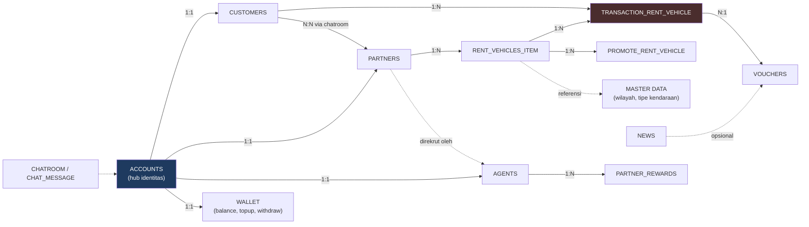

### 4.2 ER Diagram — Akun, Customer, Partner, Agent

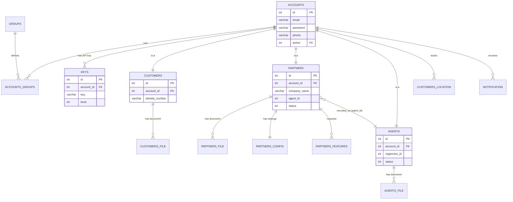

### 4.3 ER Diagram — Kendaraan & Transaksi Sewa

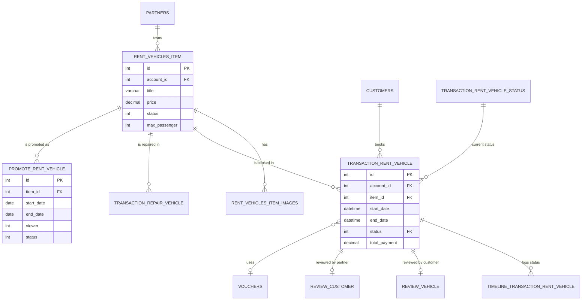

### 4.4 ER Diagram — Keuangan / Wallet

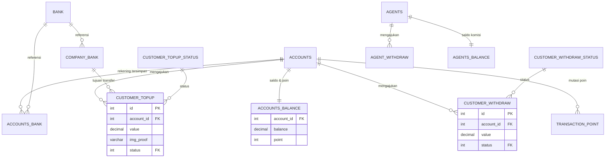

### 4.5 ER Diagram — Loyalty, Marketing & Engagement

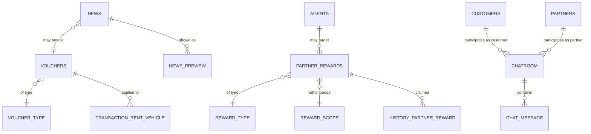

---

## 6. Flowchart per Fitur

### 6.1 Registrasi & Verifikasi Customer

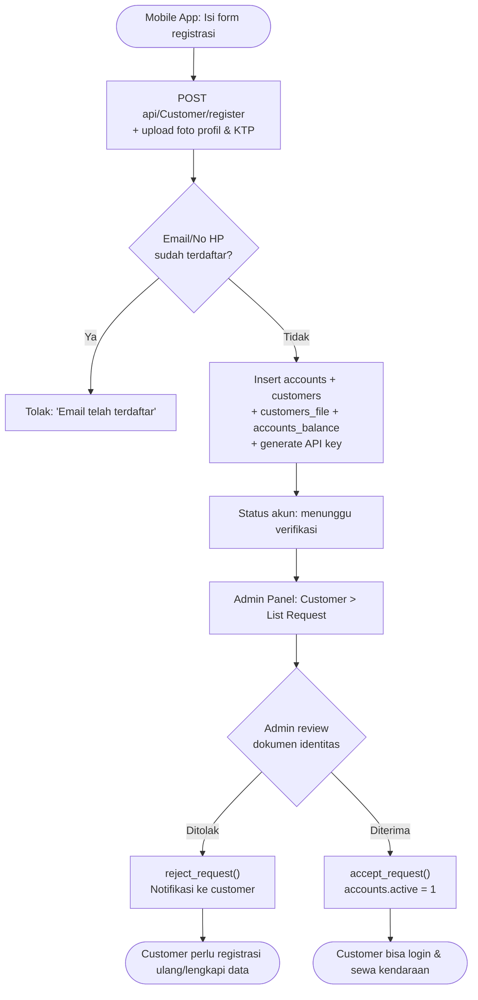

### 6.2 Registrasi & Verifikasi Partner (Mitra)

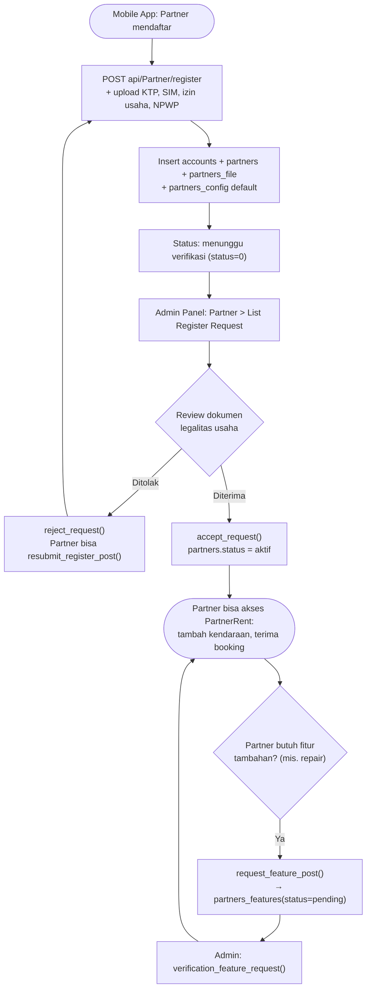

### 6.3 Rekrutmen Partner oleh Agent & Komisi

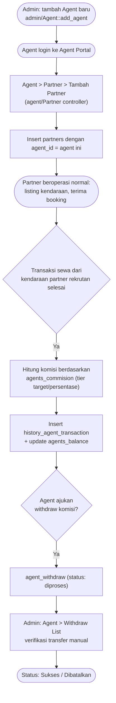

### 6.4 Pencarian & Booking Kendaraan (Checkout)

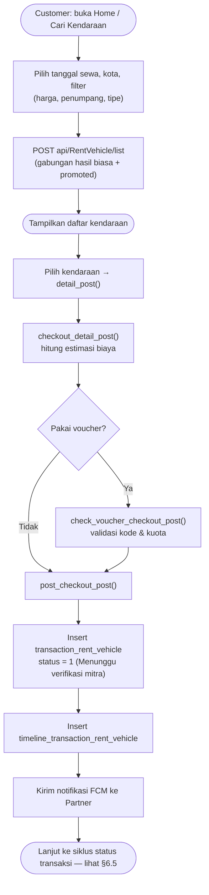

### 6.5 Siklus Status Transaksi Sewa

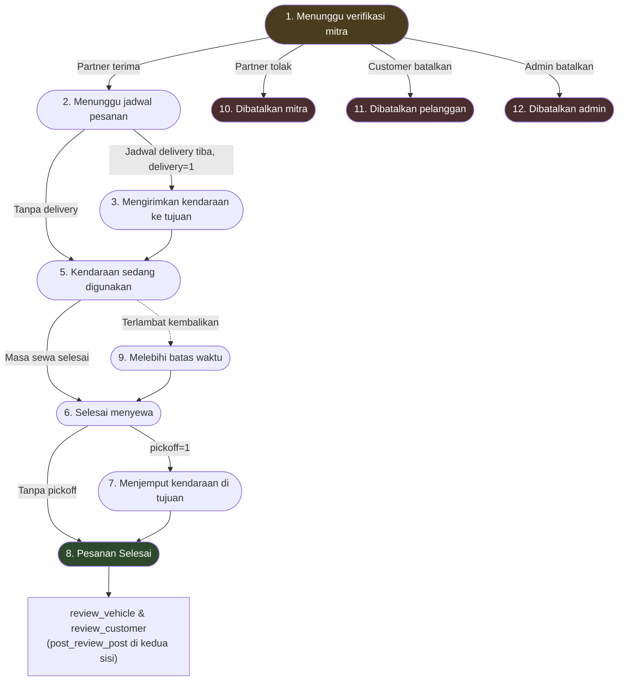
*Setiap transisi status (`update_status_transaction_post`) mencatat baris baru di `timeline_transaction_rent_vehicle` dan memicu push notification FCM ke customer & partner secara bersamaan.*

### 6.6 Topup Saldo Customer (Verifikasi Manual)

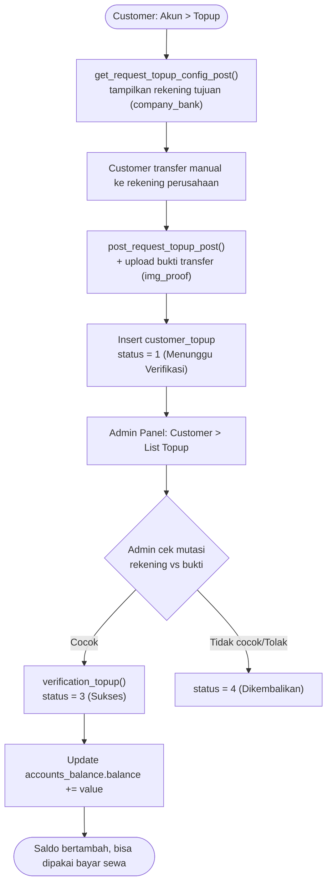

### 6.7 Withdraw Saldo (Customer & Agent)

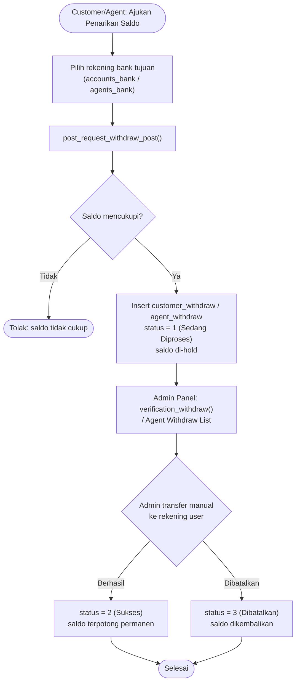

### 6.8 Promosi Kendaraan oleh Partner

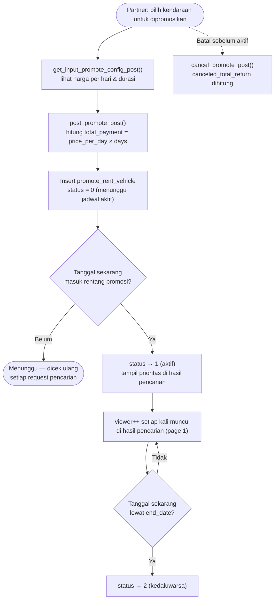

### 6.9 Chat Customer ↔ Partner

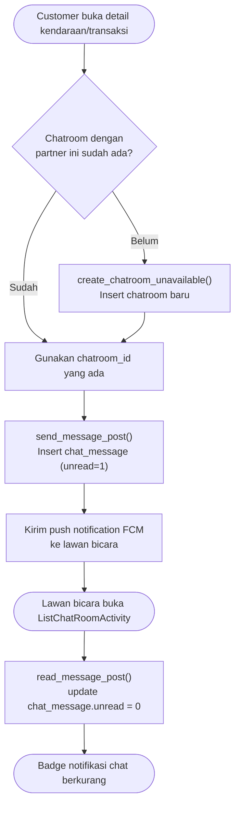

### 6.10 Reward, Voucher & Poin Loyalti

```mermaid
flowchart TD
    subgraph Voucher["Alur Voucher"]
        V1([Admin buat voucher: kode, nilai, kuota, masa berlaku]) --> V2["Customer input kode saat checkout"]
        V2 --> V3["check_voucher_checkout_post()<br/>validasi status, kuota, expired"]
        V3 --> V4["Diskon diterapkan ke total_payment"]
    end

    subgraph Reward["Alur Partner Reward"]
        R1([Admin buat partner_rewards:<br/>target transaksi + point_reward]) --> R2["Partner mencapai target<br/>dalam reward_scope (periode)"]
        R2 --> R3["list_scope_post() → tampilkan reward tersedia"]
        R3 --> R4["claim_item_reward_post()"]
        R4 --> R5["Insert history_partner_reward (claimed=1)"]
        R5 --> R6["Admin: PartnerReward > process()<br/>verifikasi & cairkan"]
    end

    subgraph Poin["Alur Poin Customer"]
        P1([Transaksi sewa selesai]) --> P2["Insert transaction_point (point_credit)"]
        P2 --> P3["Update accounts_balance.point"]
        P3 --> P4{"Customer tukar poin?"}
        P4 -- Ya --> P5["post_exchange_point_post()<br/>point_debit, konversi ke saldo/voucher"]
    end
```

---

## 7. Lampiran — Peta Endpoint per Modul

### 7.1 Modul `api` (REST, konsumen: Aplikasi Android)

| Controller | Endpoint Utama | Fitur |
|---|---|---|
| `Basic` | `check_email`, `check_phone`, `check_agent`, `get_regencies` | Validasi registrasi, master wilayah |
| `Customer` | `register`, `login`, `upload_profile_image`, `post_request_topup`, `post_request_withdraw`, `post_exchange_point` | Akun, profil, wallet, poin customer |
| `CustomerRent` | `list_transaction`, `transaction_detail`, `cancel_transaction`, `post_review` | Riwayat sewa sisi customer |
| `Partner` | `register`, `resubmit_register`, `change_company_name`, `request_feature` | Akun & profil partner |
| `PartnerRent` | `post_vehicle`, `list_vehicle`, `list_transaction`, `update_status_transaction`, `post_promote` | Manajemen kendaraan & transaksi sisi partner |
| `RentVehicle` | `list`, `detail`, `checkout_detail`, `check_voucher_checkout`, `post_checkout` | Pencarian & booking kendaraan |
| `PartnerReward` | `list_scope`, `claim_item_reward` | Reward partner |
| `Chat` | `list_chatroom`, `list_chat`, `send_message`, `read_message` | Chat customer–partner |
| `News` | `list`, `detail` | Berita/promosi in-app |

### 7.2 Modul `admin` (Web, konsumen: Staff Internal)

| Controller | Fungsi Utama | Fitur |
|---|---|---|
| `Dashboard` | `summary`, `get_summary` | Ringkasan statistik |
| `Customer` | `accept_request`, `reject_request`, `verification_topup`, `verification_withdraw` | Verifikasi customer & wallet |
| `Partner` | `accept_request`, `reject_request`, `verification_feature_request` | Verifikasi partner & fitur tambahan |
| `Agent` | `add_agent`, `edit_agent`, `list_commision`, `post_commision` | Manajemen agent & tier komisi |
| `RentVehicle` | `post_functional_type`, `post_brand`, `post_vehicle_model` | Master data kendaraan |
| `PartnerReward` | `add_reward`, `process` (klaim) | Program reward partner |
| `Voucher` | `add_voucher`, `change_status` | Manajemen voucher |
| `News` | `add_news`, `send_notification`, `post_preview` | Konten & broadcast notifikasi |
| `Report` | `agent_transaction_report`, `partner_transaction_report`, `topup_report`, `withdraw_report` | Laporan keuangan & transaksi |
| `Config` | `set_config`, `post_bank`, `post_feature` | Konfigurasi global, bank, fitur |

### 7.3 Modul `agent` (Web, konsumen: Agent)

| Controller | Fungsi Utama | Fitur |
|---|---|---|
| `Dashboard` | `summary` | Ringkasan performa agent |
| `Partner` | tambah/kelola partner rekrutan | Rekrutmen mitra |
| `Config` | profil, rekening bank agent | Pengaturan akun agent |
| `Agent` | data diri agent | Profil |

---

## Catatan

- Diagram & DDL disusun berdasarkan pembacaan langsung `database/db_rentone_06_Dec_2021.sql` dan source code modul `admin`/`agent`/`api` per 19 Juli 2026 — bukan hasil generate otomatis dari tools ERD, sehingga sebaiknya divalidasi ulang terhadap skema live jika sudah ada perubahan setelah tanggal dump tersebut.
- Relasi `partners.agent_id` dan `customers.referal_id` / `partners.referal_id` **tidak** memiliki `FOREIGN KEY` constraint eksplisit di database (hanya kolom biasa) — pada diagram ER ditandai sebagai relasi putus-putus (`-.-`) atau `}o--||` tanpa jaminan integritas referensial dari database, murni dikontrol oleh application logic.
- Untuk detail temuan keamanan pada modul-modul ini, lihat [RentOn-Audit-Keamanan-Backend.md](RentOn-Audit-Keamanan-Backend.md). Untuk detail optimasi performa pencarian, lihat [RentOn-Audit-Performa-Pencarian-Kendaraan.md](RentOn-Audit-Performa-Pencarian-Kendaraan.md).
